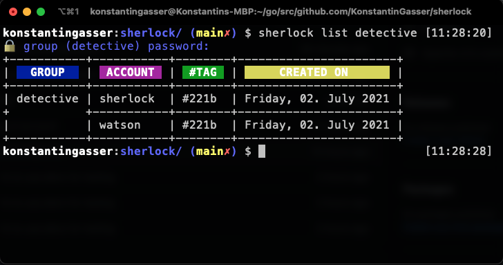

# sherlock  

> ***simple*** and ***easy*** CLI password manager

    

## Installation 

## Homebrew
`brew tap KonstantinGasser/sherlock`
`brew install sherlock`

### go
`go get github.com/KonstantinGasser/sherlock`

### from source
requires a [go](https://golang.org) installation

`git clone git@github.com/KonstantinGasser/sherlock`

`cd sherlock && go install` 

# Usage

## setup
required the first time you use `sherlock`. It will let you define the main password for the `default` group

### command

`sherlock setup`

## add

add allows adding either `groups` or `accounts` to `sherlock`

### command: group

`sherlock add group detective`
|Option|Description|
|-|-|
|--insecure| allows insecure passwords|

`detective` will be a new group protected with a password

### command: account

`sherlock add account detective@bakerstreet --tag 221b`

### options:

|Option|Description|
|-|-|
|--tag | appends the account with tag info|
|--insecure| allows insecure passwords|

## del

del allows deleting an `account` from sherlock

### command: account

`sherlock del accoount detective@bakerstreet`

### options:

|Option|Description|
|-|-|
|--force |bypasses the confirmation prompt|

### options:

Option|Description|
|-|-|
|--tag |filter accounts by tag name|

## update

allows updating the accounts password or account name

### command

`sherlock update name detective@backerstreet`

`sherlock update password detective@backerstreet`
### options:

|Option|Description|
|-|-|
|--insecure| allows insecure passwords|

## list

list all accounts from a `sherlock group`. If no group is provided will use `default` group
### command

`sherlock list detective`

### options:
Option|Description|
|-|-|
|--tag |filter accounts by tag name|

## get

get an account password

### command

`sherlock get detective@bakerstreet`

### options

|Option|Description|
|-|-|
|--verbose|print (and copy to clipboard) password to cli (default is just copy to clipboard)|

## Credits

Project dependencies/libraries:

- [olekukonko/tablewriter](https://github.com/olekukonko/tablewriter)
- [m1/go-generate-password](https://github.com/m1/go-generate-password)
- [enescakir/emoji](https://github.com/enescakir/emoji)
- [spf13/cobra](https://github.com/spf13/cobra)
- [fatih/color](https://github.com/fatih/color)

