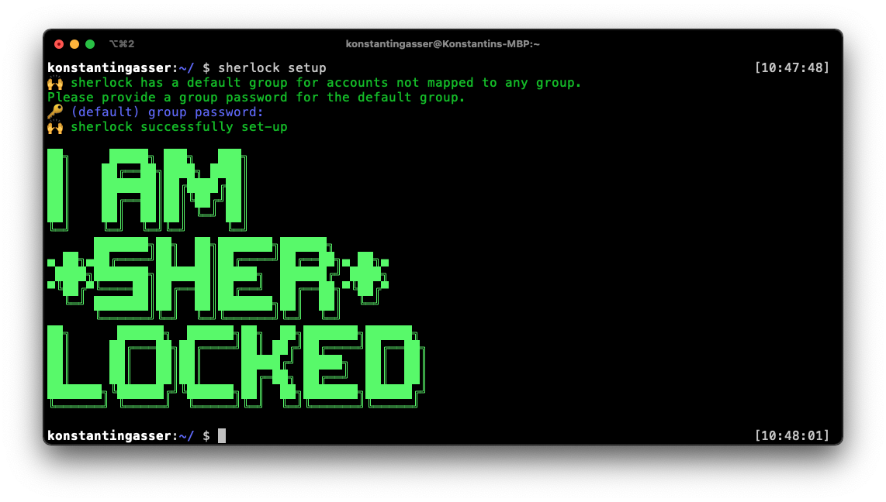

# 🕵️‍♀️🕵️   sherlock  

> ***simple*** and ***easy*** CLI password manager

    

## Installation 

## Homebrew
`brew tap KonstantinGasser/sherlock`
`brew install sherlock`

### go
`go get github.com/KonstantinGasser/sherlock`

### from source
requires a [go](https://golang.org) installation

`git clone git@github.com/KonstantinGasser/sherlock`

`cd sherlock && go install` 

# Usage

## setup
required the first time you use `sherlock`. It will let you define the main password for the `default` group

### command
`sherlock setup`

## add
add allows to add either `groups` or `accounts` to `sherlock`

### command: group
`sherlock add --group detective` 

`detective` will be its own group protected with a password

### command: account
`sherlock add --gid detective --name bakerstreet --tag 221b`

### options:
|Option|Description|
|-|-|
|--gid `group`|will map account to group|
|--tag | appends the account with a tag info|
|--insecure| allows insecure passwords|

## list
prints all accounts mapped to a group the the cli 

### command
`sherlock list detective`

### options:
Option|Description|
|-|-|
|--tag |filter accounts by tag name|

## get
get an account password

### command
`sherlock get detective@bakerstreet`

### options
|Option|Description|
|-|-|
|--verbose|print (and copy to clipboard) password to cli (default is just copy to clipboard)|

